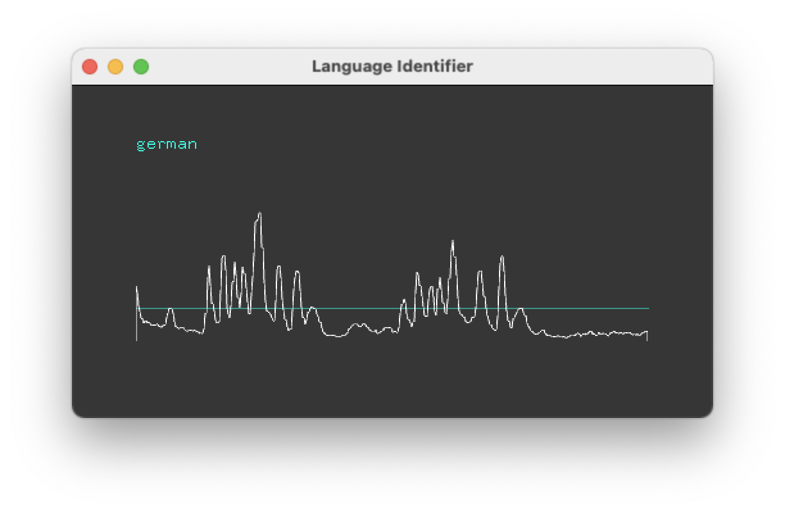

Language Identifier
===================



Identification of chosen languages from a live audio stream
 
This code base has been developed by [ZKM | Hertz-Lab](https://zkm.de/en/about-the-zkm/organization/hertz-lab) as part of the project [»The Intelligent Museum«](#the-intelligent-museum). 

Please raise issues, ask questions, throw in ideas or submit code, as this repository is intended to be an open platform to collaboratively improve language identification.

Copyright (c) 2021 ZKM | Karlsruhe.  
Copyright (c) 2021 Paul Bethge.  
Copyright (c) 2021 Dan Wilcox.  

BSD Simplified License.

Dependencies
------------

* [openFrameworks](https://openframeworks.cc/download/)
* openFrameworks addons:
  - ofxOSC (included with oF)
  - [ofxTensorFlow2](https://github.com/zkmkarlsruhe/ofxTensorFlow2)
* [CLI11 parser](https://github.com/CLIUtils/CLI11): included in `src`
* [Language Identification](https://github.com/zkmkarlsruhe/language-identification): trained neural networks placed in `bin/data` 

Tested Platforms
----------------

* MacBook Pro 2017, macOS 10.15 & openFrameworks 0.11.2
* MacBook Pro 2018, macOS 11.3.1 & openFrameworks 0.11.2

Structure
---------

* src/: contains the openFrameworks C++ code
* bin/data/model_*: contains the SavedModels trained with TensorFlow2

Installation & Build
--------------------

Overview:

1. Follow the steps in the ofxTensorFlow2 "Installation & Build" section for you platform
2. Generate the project files for this folder using the OF ProjectGenerator
3. Build for your platform

### Generating Project Files

Project files are not included so you will need to generate the project files for your operating system and development environment using the OF ProjectGenerator which is included with the openFrameworks distribution.

To (re)generate project files for an existing project:

1. Click the "Import" button in the ProjectGenerator
2. Navigate to the project's parent folder ie. "apps/myApps", select the base folder for the example project ie. "LanguageIdentifier", and click the Open button
3. Click the "Update" button

If everything went Ok, you should now be able to open the generated project and build/run the example.

### macOS

On macOS, a couple of additional manual steps are required to use ofxTensorflow2:

1. Enable C++14 in openFrameworks (only once, Xcode + Makefile)
2. Invoke `macos_install_libs.sh` in the Xcode project's Run Script build phases (after every project regeneration, Xcode only)

See the detailed steps in the [ofxTensorflow2 readme](https://github.com/zkmkarlsruhe/ofxTensorFlow2#macos).

For an Xcode build, open the Xcode project, select the "LanguageIdentifier Debug" scheme, and hit "Run".

For a Makefile build, build and run on the terminal:

```shell
cd LanguageIdentifier
make ReleaseTF2
make RunRelease
```
### Linux

Build and run on the terminal:

```shell
cd LanguageIdentifier
make Release
make RunReleaseTF2
```

Usage
-----

The openFrameworks application runs the language identification model using audio input. The detection status and detected language is sent out using OSC (Open Sound Control) messages.

### Key Commands

* `l`: toggle start/stop listening
* `a`: toggle listening auto stop after detection

### OSC Communication

#### Sending

By default, sends to:
* address: `localhost` ie. `127.0.0.1`
* port: `9999`

Message specification:

* **/detected _status_**: detection status
  - status: float, boolean 1 found - 0 lost
* **/lang _index_ _name_ _confidence_**: detected language
  - index: int, language map index
  - name: string, language map name
  - confidence: float, confidence percentage 0 - 100

#### Receiving

By default, listens on:
* port `9898`

Message specification:

* **/listen**: start listening
* **/listen _state_**: start/stop listening
  - state: bool, 0 - stop, 1 - start
* **/autostop**: enable listening auto stop after detection
* **/autostop _state_**: enable/disable listening auto stop after detection
  - state: bool, 0 - keep listening, 1 - stop on detection

### Commandline Options

Additional run time settings are available via commandline options as shown via the `--help` flag output:

```shell
% bin/LanguageIdentifier --help
identifies spoken language from audio stream
Usage: LanguageIdentifier [OPTIONS]

Options:
  -h,--help                   Print this help message and exit
  -s,--senders TEXT ...       OSC sender addr:port host pairs, ex. "192.168.0.100:5555" or multicast "239.200.200.200:6666", default "localhost:9999"
  -p,--port INT               OSC receiver port, default 9898
  -c,--confidence FLOAT:FLOAT bounded to [0 - 1]
                              min confidence, default 0.75
  -t,--threshold FLOAT:INT bounded to [0 - 100]
                              volume threshold, default 25
  -l,--list                   list audio input devices and exit
  --inputdev INT              audio input device number
  --inputname TEXT            audio input device name, can do partial match, ex. "Microphone"
  --inputchan INT             audio input device channel, default 1
  -r,--samplerate INT         audio input device samplerate, can be 441000 or a multiple of 16000, default 48000
  --nolisten                  do not listen on start
  --autostop                  stop listening automatically after detection
  -v,--verbose                verbose printing
  --version                   print version and exit
```

For example, to send OSC to multiple addresses use the `-s` option:

```shell
% bin/LanguageIdentifier -s localhost:9999 localhost:6666 192.168.0.101:7777
```

#### macOS

For macOS, the application binary can be invoked from within the .app bundle to pass commandline arguments:

```shell
bin/LanguageIdentifier.app/Contents/MacOS/LanguageIdentifier -h
```

This approach can also be wrapped up into a shell alias to be added to the account's `~/.bash_profile` or `~/.zshrc` file:

```
alias langid="/Applications/LanguageIdentifier.app/Contents/MacOS/LanguageIdentifier"
```

Reload the shell and application can now be invoked via:

```shell
% langid -v --inputdev 2
```

Demos
-----

The demos consist of rapid prototypes built using the following components:

* language identifier
* visual front end: [loaf](http://danomatika.com/code/loaf)

Custom visual front ends are written in Lua for [loaf](http://danomatika.com/code/loaf), a Lua interpreter with bindings for [openFrameworks](http://openframeworks.cc/) which includes a built-in Open Sound Control (OSC) server.

### Usage

To set up a run environment on macOS, download loaf and place the .app in the system `/Applications` folder.

To run a loaf project, drag the main Lua script or project folder onto the loaf.app.

Notes
-----

### Sample Rate

The model inputs audio with a sample rate of 16 kHz, so the incoming stream is downsampled and the app's input sample rate needs to be a multiple of 16, ie. 48kHz, 92kHz, etc.

As 44.1kHz is also common, it is accepted and treated as 48kHz but the downsampled audio is then higher in pitch and may be noisy. In our tests, however detection is still acceptable.

Develop
-------

### Release steps

1. Update changelog
2. Update app version in Xcode project and ofApp.h define
3. Tag version commit, ala "0.3.0"
4. Push commit and tags to server:

    git commit push
    git commit push --tags

The Intelligent Museum
----------------------

An artistic-curatorial field of experimentation for deep learning and visitor participation

The [ZKM | Center for Art and Media](https://zkm.de/en) and the [Deutsches Museum Nuremberg](https://www.deutsches-museum.de/en/nuernberg/information/) cooperate with the goal of implementing an AI-supported exhibition. Together with researchers and international artists, new AI-based works of art will be realized during the next four years (2020-2023).  They will be embedded in the AI-supported exhibition in both houses. The Project „The Intelligent Museum” is funded by the Digital Culture Programme of the [Kulturstiftung des Bundes](https://www.kulturstiftung-des-bundes.de/en) (German Federal Cultural Foundation) and funded by the [Beauftragte der Bundesregierung für Kultur und Medien](https://www.bundesregierung.de/breg-de/bundesregierung/staatsministerin-fuer-kultur-und-medien) (Federal Government Commissioner for Culture and the Media).

As part of the project, digital curating will be critically examined using various approaches of digital art. Experimenting with new digital aesthetics and forms of expression enables new museum experiences and thus new ways of museum communication and visitor participation. The museum is transformed to a place of experience and critical exchange.


